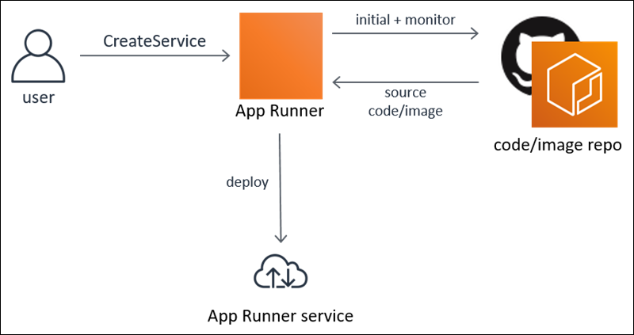

## AWS App Runner

**Introduction**

- AWS App Runner is an AWS service thats offers a fast, simple, and cost-effective method to deploy from source code or a container image directly to a scalable and secure web application in the AWS Cloud.

- App Runner integrates directly to the code or image repository. It offers an out of the box integration and delivery pipeline with fully managed operations, high performance, scalability, and security.

-  Out of the box, App Runner is built for web scale, so there is no need to re-platform or re-architect as the business grows. It makes it simpler for customers to rapidly deliver innovative solutions and business value.

      

- We can define and configure your App Runner service deployments using any one of the following interfaces:

  - App Runner console 

  - App Runner API

  - AWS Command Line Interface (AWS CLI)

  - AWS SDKs

- AWS App Runner makes it easier for you to deploy web apps and APIs to the cloud, regardless of the language they are written in, even for teams that lack prior experience deploying and managing containers or infrastructure 

- **Deploying from Source**

- **Deploy from a Container Image**
