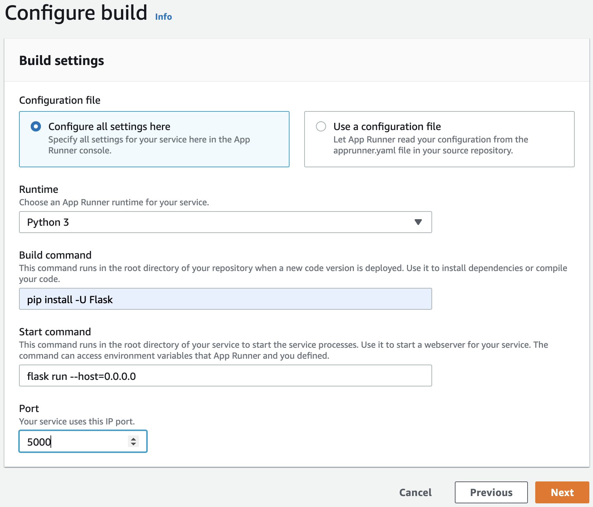
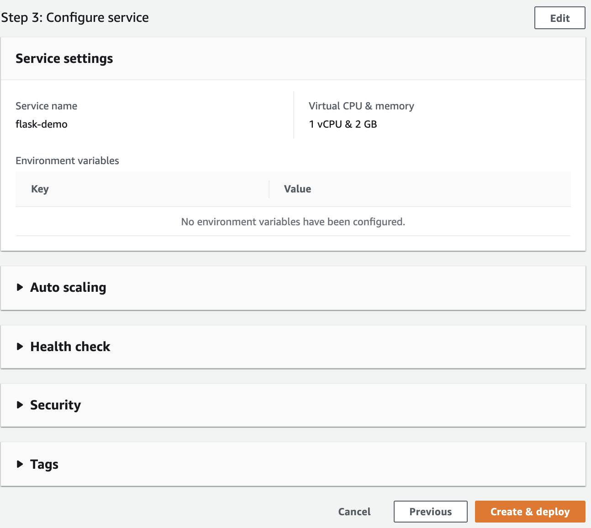

## AWS App Runner

**Introduction**

- AWS App Runner is an AWS service that offers a fast, simple, and cost-effective method to deploy from source code or a container image directly to a scalable and secure web application in the AWS Cloud.

- App Runner integrates directly to the code or image repository. It offers an out of the box integration and delivery pipeline with fully managed operations, high performance, scalability, and security.

-  Out of the box, App Runner is built for web scale, so there is no need to re-platform or re-architect as the business grows. It makes it simpler for customers to rapidly deliver innovative solutions and business value.

- AWS App Runner makes it easier for you to deploy web apps and APIs to the cloud, regardless of the language they are written in, even for teams that lack prior experience deploying and managing containers or infrastructure   

- How AWS App Runner Service Works? 

       

- We can define and configure your App Runner service deployments using any one of the following interfaces:

  - App Runner console 

  - App Runner API

  - AWS Command Line Interface (AWS CLI)

  - AWS SDKs

    

- **Deploying from Source**
    
    1. Traverse to the <a href="https://console.aws.amazon.com/apprunner/">AWS App Runner</a> and select Create an App Runner service

         
    
    2. Under Source related information provide Repository type, we will select Source code repository and then follow the instructions to connect the service to the GitHub account, post the connection provide Github repository and branch details

       - Click Add New button to establish the connection, provide Github connection name and click Install another

             
       
       - Configure right permission for this connection i.e all Github repository or specific selected repositories and click Install
       
             
            
       - Now you will be back on the Create Connection console, select the account name from the drop down under Github App and click Next
       
             
       
       - Github connection is successful, next provide the Github repository and branch details from the drop

             

    3. Under Delpoyment Settings, we will select deployment trigger as Automatic. This means when App Runner detects any changes in the Github repo, it automatically kick-off the build and deployment process. Post Delpoyment Settings click Next
    
        
    
    4. Now we will configure the build. For Runtime, we will select Python 3, currently the service supports two languages: Python and Node.js for other environments we should opt for container registry workflow, along with selection of Runtime also provide details like Build command, Start command, and Port fields, as shown here
    
        
    
    5. Next, we will provide a name to the service, choose the CPU and memory size that we want to allocate to the container
    
        
    
    6. By default, we will have one instance of the container image, but we can looking for advance functionalities like autoscaling, health check, and security to ensure scalability and security for the application which are the core measures from production point

        
     
    7. Finally, we will review the configuration of the service and then select Create & deploy
    
        
    
    8. After a few minutes, the application will be available to access, by default App Runner secure the application by enforcing HTTPS secure traffic without explicitly handling in the container image
        
        

- **Deploy from a Container Image**

    1. Traverse to the <a href="https://console.aws.amazon.com/apprunner/">AWS App Runner</a> and select Create an App Runner service

         
